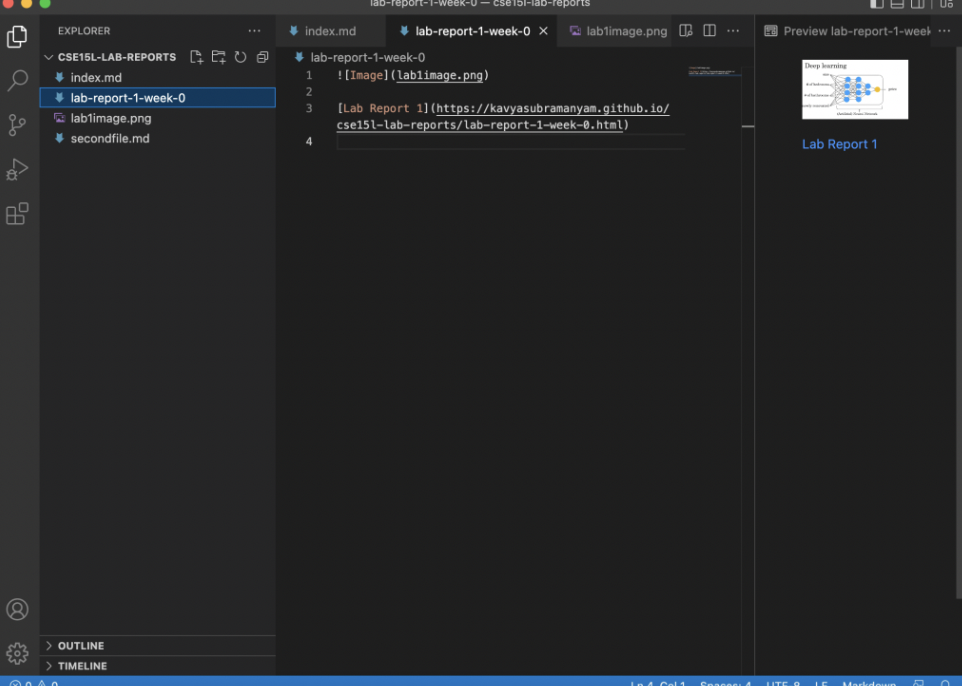
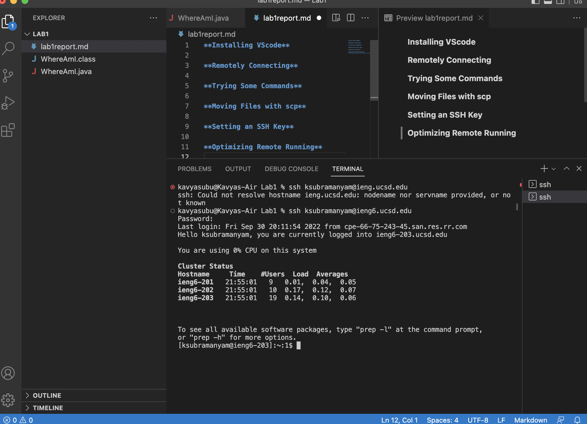
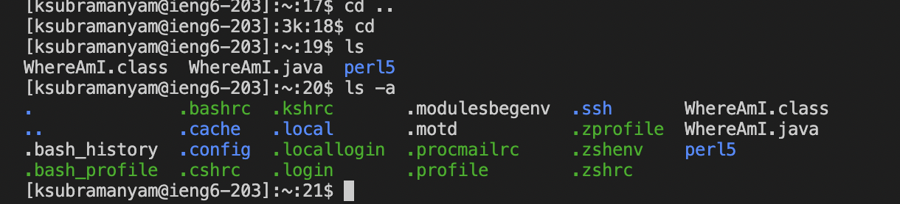
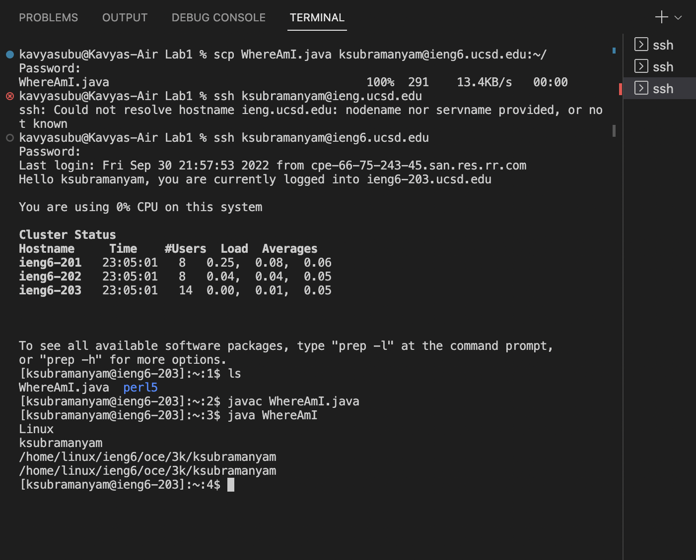
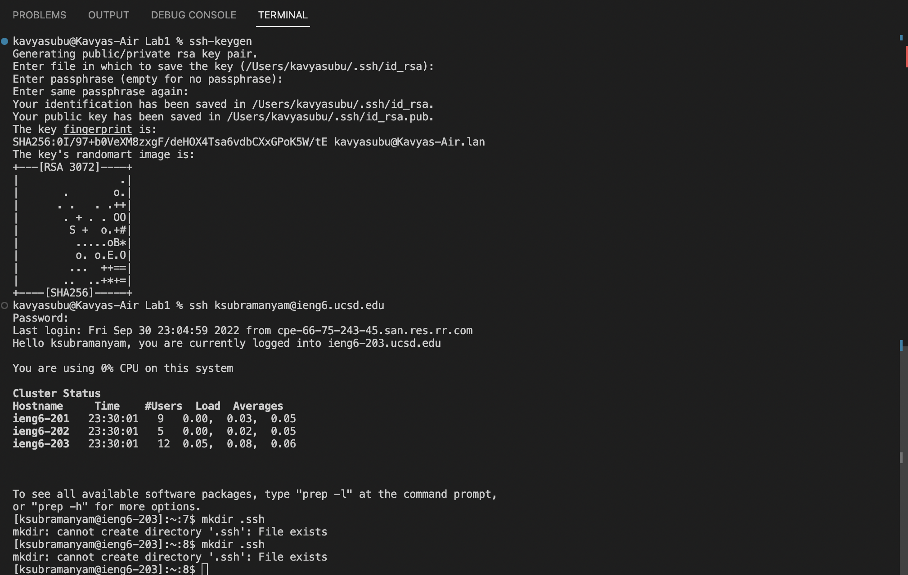
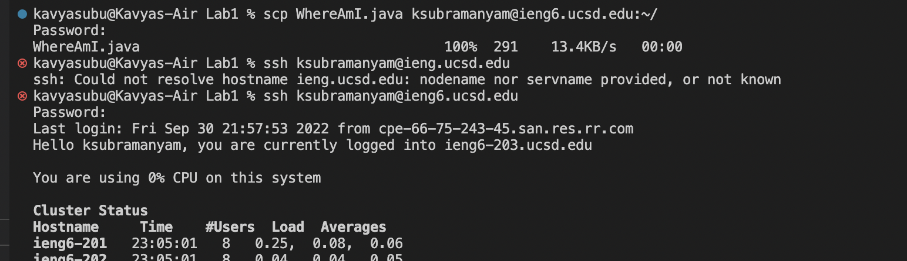

**Installing VScode**

- I already had VScode installed on my laptop from a internship I worked over the summer, but this is an example of what opening VScode can look like. VScode is particullarly helpful for easily navigating several folders and files with several lines of codes. When working on large projects with hundreds of files with millions of lines of code, using global search tools to find specific lines of code was made especially easy with VScode. VScode has a terminal function to switch between remote computers and run commands, as well as a tool to preview markdown files. 

**Remotely Connecting**
- In order to remotely connect to a computer, open terminal in VScode. From there use the command "ssh" followed by the login for the remote computer. For this class it will be "cs15lfa22**@ieng6.ucsd.edu" (** replaced by two characters specific to your account) As this is my first time using a remote login, there was some issues with resetting the password on my course-specific account. While I get that sorted, I was able to remotely connect to my personal ucsd account (as shown in image). I am now in my ucsd account on my local machine and can access files and folders on it! 

**Trying Some Commands**
- There are several useful commands that can be used in terminal. In addition to be able to compile and run java files, you can navigate directories and information about the machine you are operating from. For example, the ls -a command will list all files in a folder including hidden files that start with a ‘.’

**Moving Files with scp**
- You can copy files from one computer to another using scp. It essentially works as a copy paste function. Here, I "copied" the WhereAmI.java file from my local machine and "pasted" it into my ucsd account related computer. There, you can compile and run the program just as you would on the local machine. 

**Setting an SSH Key**
- For the SSH key, I was able to create a public/private rsa key pair and save it into a specified direcotry on my local computer. I was also able to switch into my remote computer. However I was not able to successfully execute "mkdir .ssh" to create the new directory. 

**Optimizing Remote Running**
Something I found particularly useful when completing this lab was the arrow up key. When I would make a small typo or need to repeat a command from a previous line, I was able to arrow up and edit the line or run it again, as I did here when I accidentally didnt include a "6" after the ieng in the ssh command. 
