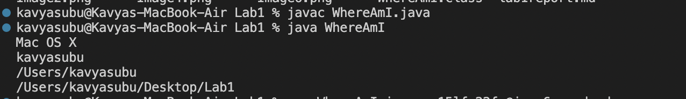

**Installing VScode**
- I already had VScode installed on my laptop from a internship I worked over the summer, but this is an example of what opening VScode can look like. VScode is particullarly helpful for easily navigating several folders and files with several lines of codes. When working on large projects with hundreds of files with millions of lines of code, using global search tools to find specific lines of code was made especially easy with VScode. VScode has a terminal function to switch between remote computers and run commands, as well as a tool to preview markdown files. 

**Remotely Connecting**
- In order to remotely connect to a computer, open terminal in VScode. From there use the command "ssh" followed by the login for the remote computer. For this class it will be "cs15lfa22xx@ieng6.ucsd.edu" (xx replaced by two characters specific to your account). As this is my first time using a remote login, there was some issues with resetting the password on my course-specific account. After resetting the password again I was able to successfully login to my cs15l account (as shown in the image below). I am now in my ucsd account on my local machine and can access files and folders on it! 

**Trying Some Commands**
- There are several useful commands that can be used in terminal. In addition to being able to compile and run java files, you can navigate directories and information about the machine you are operating from. For example, the ls command will list all files in the folder you're in, while cd + the name of the folder or file will navigate into that folder. Commands like "pwd" command writes to standard output the full path name of the current directory. The "mkdir" command means "make directory" which resulted in a "Permission denied" error for my local and remote computer which means that there is limited access on my computer. The cp command makes a copie a file or folder into a specified destination. 

**Moving Files with scp**
- You can copy files from one computer to another using scp. It essentially works as a copy paste function. Here, I copied the WhereAmI.java file from my local machine and "pasted" it into my cs15l-ucsd computer. When using the scp command, include the name of the file and the destination computer, followed by the directory which you want the file to pasted in. For home directory, use ':~/'. Once you're on the remote computer where you pasted the file, you can compile and run the program just as you would on the local machine. 

**Setting an SSH Key**
- For the SSH key, I was able to generate a public/private rsa key pair using the command "ssh-keygen" and save it into a specified direcotry on my local computer using the command. I saved the key into the default path and pressed enter when prompted for a passphrase. I was also able to switch into my remote computer and create a ".ssh" directory to save the key into using the mkdir command. After that, I used scp to copy the public key from my local computer into the ssh directory on my remote computer. Finally, I tested that I could login without a password using the ssh command into my cs15l account, and I succesfully logged in with no password!

**Optimizing Remote Running**
- Something I found particularly useful when completing this lab was the arrow up key. After making local edits to the "WhereAmI.java" file, I was able to arrow up to the last time I compiled and ran the program, which resulted in a total of 4 key strokes to execute the program. Another useful tip is to run multiple commands on the same line, separated by colons (;). 

