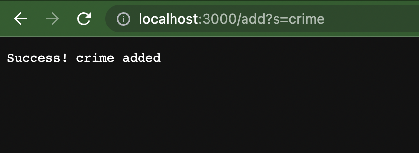
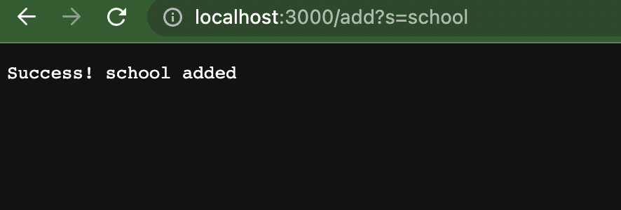
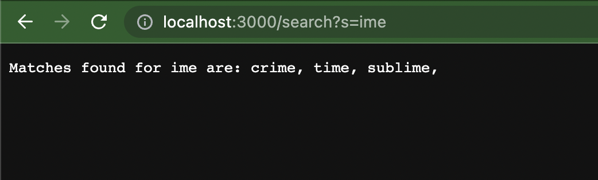

# **Lab 3**

## **Part 1**
Search Engine Class implementation: 

    import java.io.IOException;
    import java.net.URI;
    import java.util.*;

            class Handler implements URLHandler {
                // The one bit of state on the server: a number that will be manipulated by
                // various requests.
                List<String> listOfStrings = new ArrayList<>();
                int index = 0;

                public String handleRequest(URI url) {
                    if (url.getPath().equals("/")) {
                        return ("Done!");
                    } else {
                        System.out.println("Path: " + url.getPath());
                        if (url.getPath().contains("/add")) {
                            index ++;
                            String[] parameters = url.getQuery().split("=");
                            if (parameters[0].equals("s")) {
                                listOfStrings.add(parameters[1]);
                                return ("Success! "+ parameters[1] + " added");
                            }
                        }
                        if (url.getPath().contains("/search")) {
                            String[] parameters = url.getQuery().split("=");
                            String matchesFound = "Matches found for " + parameters[1] + " are: ";
                            for(String n : listOfStrings){
                                if(n.contains(parameters[1])){
                                    matchesFound += n + ", ";
                                }
                            }
                            return matchesFound;
                    }
                    return "404 Not Found!";
                }
            }
            }
            class SearchEngine {
                public static void main(String[] args) throws IOException {
                    if(args.length == 0){
                        System.out.println("Missing port number! Try any number between 1024 to 49151");
                        return;
                    }

                    int port = Integer.parseInt(args[0]);

                    Server.start(port, new Handler());
                }
            }

Inputs and Outputs: 

