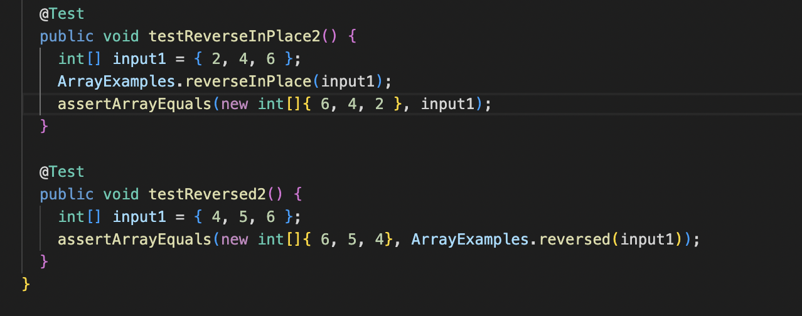
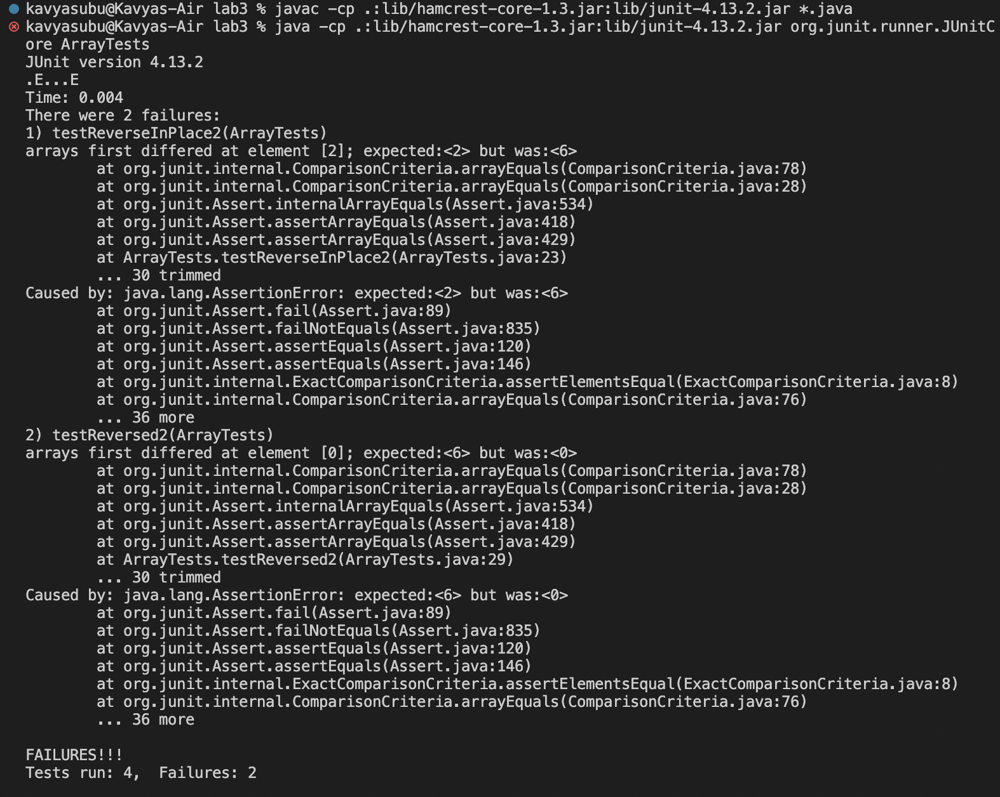
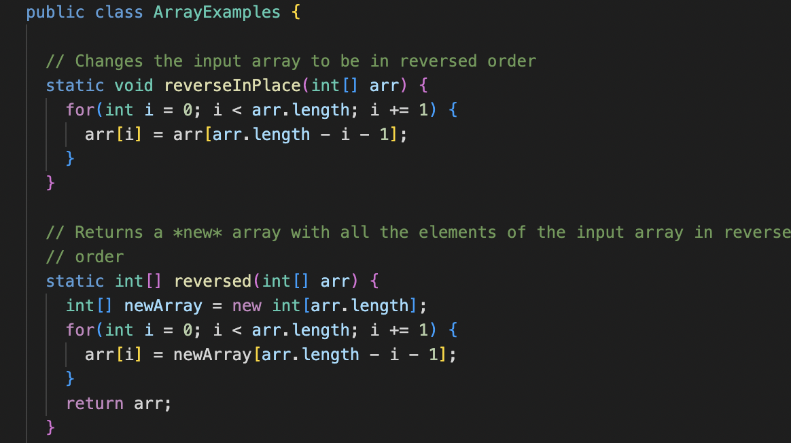
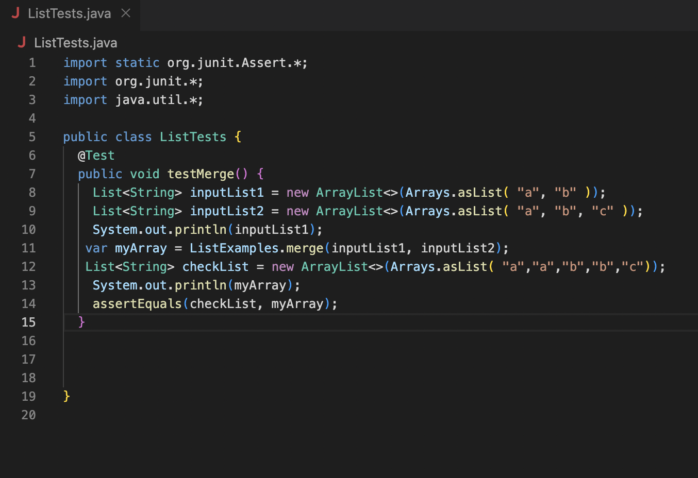
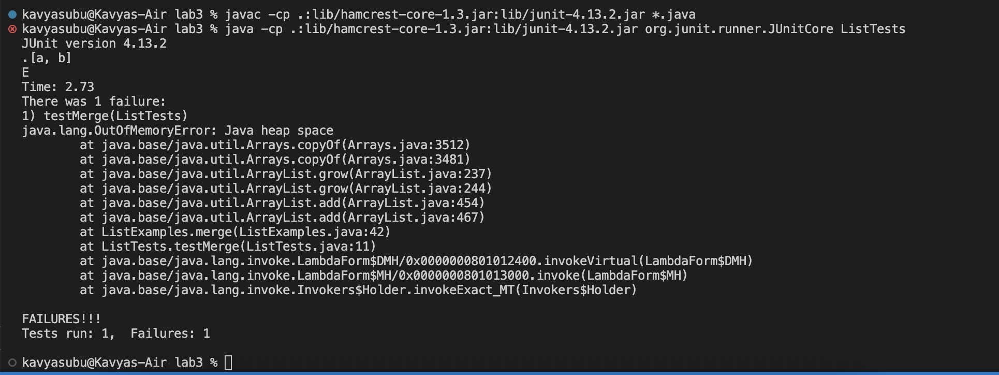
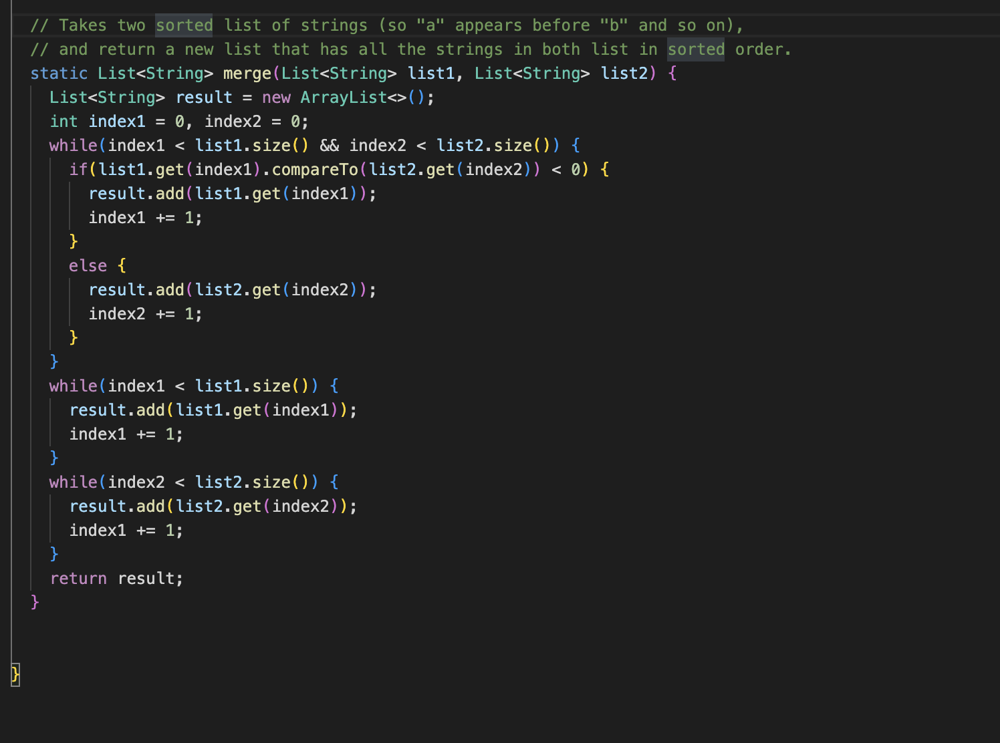

# **Lab 3**

## **Part 1**
Search Engine Class implementation: 

    import java.io.IOException;
    import java.net.URI;
    import java.util.*;

            class Handler implements URLHandler {
                // The one bit of state on the server: a number that will be manipulated by
                // various requests.
                List<String> listOfStrings = new ArrayList<>();
                int index = 0;

                public String handleRequest(URI url) {
                    if (url.getPath().equals("/")) {
                        return ("Done!");
                    } else {
                        System.out.println("Path: " + url.getPath());
                        if (url.getPath().contains("/add")) {
                            index ++;
                            String[] parameters = url.getQuery().split("=");
                            if (parameters[0].equals("s")) {
                                listOfStrings.add(parameters[1]);
                                return ("Success! "+ parameters[1] + " added");
                            }
                        }
                        if (url.getPath().contains("/search")) {
                            String[] parameters = url.getQuery().split("=");
                            String matchesFound = "Matches found for " + parameters[1] + " are: ";
                            for(String n : listOfStrings){
                                if(n.contains(parameters[1])){
                                    matchesFound += n + ", ";
                                }
                            }
                            return matchesFound;
                    }
                    return "404 Not Found!";
                }
            }
            }
            class SearchEngine {
                public static void main(String[] args) throws IOException {
                    if(args.length == 0){
                        System.out.println("Missing port number! Try any number between 1024 to 49151");
                        return;
                    }

                    int port = Integer.parseInt(args[0]);

                    Server.start(port, new Handler());
                }
            }

Inputs and Outputs: 
- First the SearchEngine class is called which parses the port number int, and then calls the Handler class to handle the rest of the URL. The Handler class is called here, and the handleRequest method is called, and it goes into the if statement that checks if the string contains the substring “/add”. The method then retrieves the query (everything after the question mark), and the value of parameters[0] is the “s” and parameters[1] is everything after the “=“, in this case “crime”. The word “crime” is added to the ArrayList listofstrings, resulting in the output “Success! crime added”. 

- Here, the program follows the same path as it does for the "crime", as explained above. 

- Here, the program follows the same path as it does for "crime" until it gets to the handleRequest method. Here, the if statement finds that the URL contains the substring "/search" and the query is parsed into "s" and "ime". The method then checks the substring "ime" for each word that exists in the ArrayList. All the words that produce a match are returned with the message "Matches found for (substring) are:" + the matches.

- This is the URL to searcch for the substring "ime". The localhost:3000 is the server where the URL requests are handled from. The substring "search" prompts the function to search for a substring, and everything after the ? is the query. 

## **Part 2**
1. Here, I wrote two tests that resulted in errors for the Array Methods class and I will explain the testReverseInPlace2. This test was for the ReverseInPlace method. The failure inducing input for reverseInPlace was {2, 4, 6}. The symptom here, as shown in the output, was that the test expected 2 at index 2 but the function outputted 6. Because all the values of the input array are different and the length is greater than 2, this symptom is showing. The bug in the function reverseInPlace is that the original values of the array are being lost as arr is being updated with the new values. The fix to this bug is that there should be a temporary array to hold the original values instead of the new array being updated over the old one.

2. In the List Example class, I wrote a test to check the merge function. I hypothesised that the failure would occur when two identical lists of length 3 were merged. I wrote the test to compare the expected output vs the actual output, and even though my test compiled it did not run and produce an output in terminal. 

